# Project: EEG-Based Eye Movement Classification using Muse 2 and Deep Learning on Raspberry Pi

# โครงการ: การใช้งานคลื่นไฟฟ้าสมองสำหรับการจำแนกการเคลื่อนไหวของดวงตาด้วย Muse 2 และ Deep Learning บนอุปกรณ์ Raspberry Pi

## รายละเอียดโครงการ

โครงการนี้มีวัตถุประสงค์ในการพัฒนาระบบ Brain-Computer Interface (BCI) เพื่อการควบคุมอุปกรณ์โดยอาศัยการวิเคราะห์การเคลื่อนไหวของดวงตา ระบบนี้ออกแบบมาเพื่อจำแนกคำสั่งออกเป็นสามประเภท ได้แก่:
- การเคลื่อนไหวของดวงตาไปทางซ้าย
- สถานะปกติ
- การเคลื่อนไหวของดวงตาไปทางขวา

## เทคโนโลยีที่ใช้
- **Muse 2 Headband**: ใช้สำหรับการวัดสัญญาณคลื่นไฟฟ้าสมอง (EEG) ที่ตำแหน่ง TP9, AF7, AF8, และ TP10
- **Raspberry Pi 3 Model B**: ใช้ในการประมวลผลข้อมูล EEG แบบเรียลไทม์และการควบคุมอุปกรณ์ภายนอก
- **BrainFlow**: ใช้สำหรับการรับสัญญาณและกรองสัญญาณในช่วงความถี่ 8-100 Hz สำหรับสัญญาณ EEG และลดทอนสัญญาณรบกวนที่ความถี่ 50 Hz
- **Deep Learning**: ใช้โครงข่าย Convolutional Neural Network 1 มิติ (Conv1D) และ Long Short-Term Memory (LSTM) ในการวิเคราะห์และแปลความหมายของสัญญาณ EEG

## ข้อมูลเพิ่มเติม
- **ผู้พัฒนา**: จิรภัทร แจ่มประเสริฐ และคณะ
- **สถาบัน**: มหาวิทยาลัยเทคโนโลยีราชมงคลล้านนา
- **วัตถุประสงค์**:
  1. พัฒนาระบบ BCI ที่สามารถตรวจจับและจำแนกสัญญาณสมองจากการเคลื่อนไหวของดวงตา
  2. ออกแบบและพัฒนาโมเดล Deep Learning สำหรับการจำแนกสัญญาณสมองเป็น 3 คลาส
  3. ทดสอบและประเมินประสิทธิภาพของระบบ BCI ในการใช้งานจริง
  4. ประยุกต์ใช้โมเดลที่พัฒนาขึ้นบน Raspberry Pi เพื่อควบคุมอุปกรณ์ LED ผ่าน GPIO

## การใช้งาน
1. ติดตั้งอุปกรณ์ Muse 2 Headband บนศีรษะ
2. เชื่อมต่อ Raspberry Pi กับ Muse 2 ผ่าน Bluetooth
3. เริ่มการเก็บข้อมูลและประมวลผลการเคลื่อนไหวของดวงตา
4. ผลลัพธ์การจำแนกจะแสดงผ่านการควบคุมอุปกรณ์ LED

## การติดตั้งและใช้งาน
```bash
# Clone repository
git clone https://github.com/username/repository.git

```


**1. การเตรียมสภาพแวดล้อมสำหรับการพัฒนาระบบ BCI**

**ติดตั้งระบบปฏิบัติการ Raspberry Pi OS Lite และการตั้งค่าเบื้องต้น**

1. เตรียมระบบปฏิบัติการสำหรับ Raspberry Pi โดยใช้โปรแกรม **Raspberry Pi Imager**

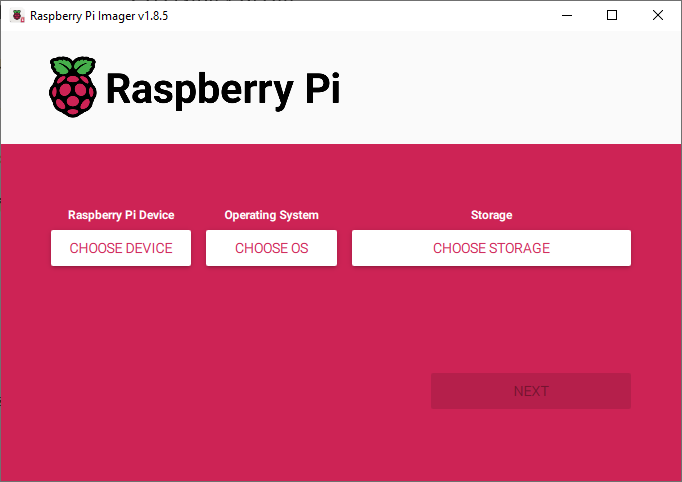

2. เลือก **Raspberry Pi 3** จากเมนู **CHOOSE DEVICE**

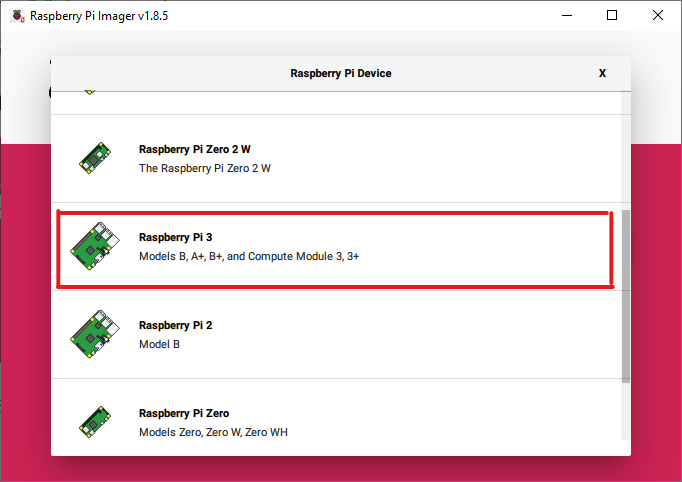

3. เลือกระบบปฏิบัติการ **Raspberry Pi OS Lite (64-bit)** จากเมนู **CHOOSE OS**

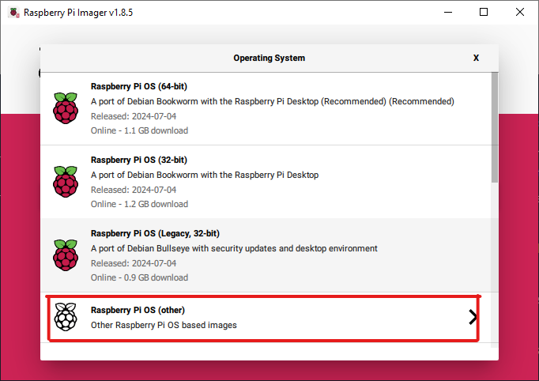

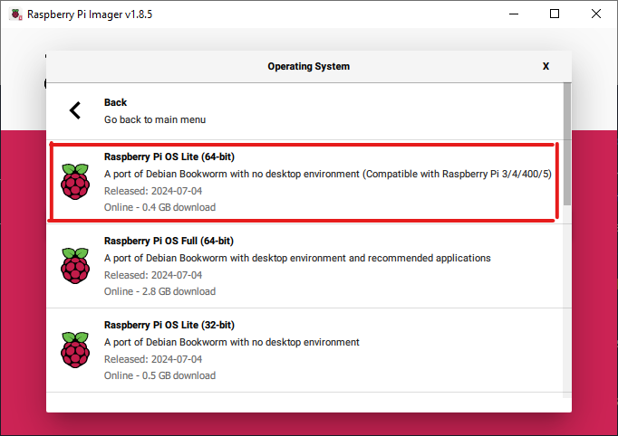

4. เลือก SD card ที่จะนำไปใช้งานกับ Raspberry Pi ในเมนู **CHOOSE STORAGE**

5. กด **NEXT** ในหน้าเมนูหลักเพื่อติดตั้งระบบปฏิบัติการลงบน SD card

6. เมื่อการติดตั้งระบบปฏิบัติการเสร็จสิ้น ให้เปิดโฟลเดอร์ของระบบปฏิบัติการบน SD card และสร้างไฟล์เปล่าที่ชื่อ **`SSH`** โดยไม่ต้องใส่นามสกุลใด ๆ
7. นำ SD card ไปใส่ใน Raspberry Pi และทำการบูตระบบปฏิบัติการ
8. เข้าถึงหน้าต่าง **Terminal** ของระบบปฏิบัติการด้วยวิธีการต่าง ๆ เช่น **SSH** ผ่าน IP ของ Raspberry Pi หรือเชื่อมต่อหน้าจอและคีย์บอร์ดโดยตรงกับอุปกรณ์

**ติดตั้งและตั้งค่าสภาพแวดล้อมเสมือน (Virtual Environment)**

1. อัปเดตระบบและติดตั้ง Python 3

   ก่อนอื่นให้คุณอัปเดตระบบเพื่อให้แน่ใจว่ามีการติดตั้งแพ็กเกจล่าสุดแล้ว

   ```shell
   sudo apt update
   sudo apt upgrade
   ```

   ตรวจสอบการติดตั้ง Python 3 โดยใช้คำสั่ง

   ```shell
   python3 --version
   ```

   หากยังไม่มี Python 3 ติดตั้ง สามารถติดตั้งได้โดยใช้คำสั่ง

   ```shell
   sudo apt install python3
   ```

2. ติดตั้ง `python3-venv`

   แพ็กเกจ `python3-venv` จำเป็นสำหรับการสร้างสภาพแวดล้อมเสมือน หากยังไม่ได้ติดตั้ง สามารถติดตั้งได้ด้วยคำสั่ง

   ```shell
   sudo apt install python3-venv
   ```

3. สร้างสภาพแวดล้อมเสมือน

   เริ่มโดยสร้างไดเรกทอรีสำหรับโปรเจกต์ของคุณและเข้าไปในไดเรกทอรีนั้น

   ```shell
   mkdir BCIPI
   cd BCIPI
   ```

   สร้างสภาพแวดล้อมเสมือนโดยใช้คำสั่ง

   ```shell
   python3 -m venv brain_env
   ```

4. เปิดใช้งานสภาพแวดล้อมเสมือน

   เปิดใช้งานสภาพแวดล้อมเสมือนด้วยคำสั่ง

   ```shell
   source brain_env/bin/activate
   ```

   หากต้องการปิดการใช้งานสภาพแวดล้อมเสมือน สามารถใช้คำสั่ง

   ```shell
   deactivate
   ```

**ติดตั้ง Tensorflow บนอุปกรณ์ Raspberry Pi**

1. อัปเดตระบบและติดตั้งไลบรารีที่จำเป็น

   ก่อนการติดตั้ง TensorFlow ควรอัปเดตระบบและติดตั้งไลบรารีที่จำเป็น

   ```shell
   sudo apt update
   sudo apt upgrade
   sudo apt install libatlas-base-dev gfortran
   sudo apt install python3-dev
   ```

2. ตรวจสอบระบบปฏิบัติการแบบ 64-bit (`aarch64`)

   ตรวจสอบว่าระบบปฏิบัติการเป็นแบบ 64-bit โดยใช้คำสั่ง

   ```shell
   uname -m
   ```

   หากผลลัพธ์คือ `aarch64` แสดงว่าระบบรองรับ 64-bit

3. เปิดใช้งานสภาพแวดล้อมเสมือน

   เปิดใช้งานสภาพแวดล้อมเสมือนด้วยคำสั่ง

   ```shell
   source brain_env/bin/activate
   ```

4. ติดตั้งและอัปเดต pip ด้วยคำสั่ง

   ```shell
   sudo apt install python3-pip
   sudo pip3 install --upgrade pip
   ```

5. ติดตั้ง TensorFlow จากไฟล์ `.whl` บน [PINTO0309/Tensorflow-bin](https://github.com/PINTO0309/Tensorflow-bin)

   ติดตั้งไลบรารีเพิ่มเติมที่จำเป็นสำหรับการติดตั้ง TensorFlow

   ```shell
   sudo apt update && sudo apt upgrade -y && sudo apt install -y libhdf5-dev unzip pkg-config python3-pip  cmake make git python-is-python3 wget patchelf && pip install -U pip --break-system-packages && pip install numpy==1.26.2 --break-system-packages && pip install keras_applications==1.0.8 --no-deps --break-system-packages && pip install keras_preprocessing==1.1.2 --no-deps --break-system-packages && pip install h5py==3.10.0 --break-system-packages && pip install pybind11==2.9.2 --break-system-packages && pip install packaging --break-system-packages && pip install protobuf==3.20.3 --break-system-packages && pip install six wheel mock gdown --break-system-packages
   ```

   ติดตั้ง TensorFlow จากไฟล์ `.whl`

   ```shell
   pip install --no-cache-dir https://github.com/PINTO0309/Tensorflowbin/releases/download/v2.15.0.post1/tensorflow-2.15.0.post1-cp311-none-linux_aarch64.whl
   ```

   ตรวจสอบความเรียบร้อยของการติดตั้ง

   ```shell
   python -c 'import tensorflow as tf;print(tf.__version__)'
   ```

**ติดตั้ง BrainFlow บนอุปกรณ์ Raspberry Pi**

1. Clone Repository ของ BrainFlow ไปยัง Folder Project

   ```shell
   git clone https://github.com/brainflow-dev/brainflow.git
   ```

2. เปิดใช้งานสภาพแวดล้อมเสมือน

   ```shell
   source brain_env/bin/activate
   ```

3. ติดตั้ง CMake สำหรับการ Compile Backend ของ BrainFlow

   ```shell
   python -m pip install cmake
   ```

4. เข้าไปยังโฟลเดอร์ tools ของ repository ที่ clone ไว้

   ```shell
   cd brainflow/tools
   ```

5. Compile ไลบรารี BrainFlow

   ```shell
   python build.py --ble
   ```

6. Compile ไลบรารี BrainFlow

   ```shell
   cd brainflow/python_package
   python -m pip install -U .
   ```

**ติดตั้ง jupyter notebook**

1. เปิดใช้งานสภาพแวดล้อมเสมือน

   ```shell
   source brain_env/bin/activate
   ```

2. ติดตั้ง Jupyter Notebook

   ```shell
   pip3 install jupyter
   ```

3. เรียกใช้งาน Jupyter Notebook บนทุก IP ที่เชื่อมต่อกับ Raspberry Pi

   ```shell
   jupyter notebook --ip=0.0.0.0 --no-browser 
   ```

4. เข้าถึง Jupyter Notebook จากเครื่องอื่นในเครือข่ายโดยใช้ IP Address ของ Raspberry Pi ดังนี้

   ```html
   http://<IP ของ Raspberry Pi>:8888
   ```

**2. โค้ดสำหรับการบันทึกคลื่นไฟฟ้าสมอง **

```python
from brainflow.board_shim import BoardShim, BrainFlowInputParams, BoardIds
from brainflow.data_filter import DataFilter, FilterTypes, DetrendOperations

import time
import numpy as np
import os

# art text
from art import *

# GPIO
import RPi.GPIO as GPIO

# กำหนดค่า board id เอง เชื่อมต่อกับ MUSE 2
board_id = 38  

# กำหนดค่า sampling rate (fs) ตาม board ที่ใช้
fs = BoardShim.get_sampling_rate(board_id)

delay = 1  # หน่วงเวลาระหว่างการเก็บข้อมูลในหน่วยวินาที
overlap = int(256 * 0.2)  # กำหนดค่าการซ้อนทับ (overlap) 20%

N_DURATION = 1  # ระยะเวลาการเก็บข้อมูลในแต่ละ loop
N_SAMPLE = 30  # จำนวนชุดข้อมูลที่จะเก็บ

N_data = fs * delay + overlap  # จำนวนข้อมูลที่จะเก็บในแต่ละครั้ง

# ลำดับสถานะ (states) ที่จะใช้ในการบันทึกข้อมูล
seq_states = ["Saccades Left", "Center", "Saccades Right"]

# ตั้งค่า GPIO pin สำหรับใช้ buzzer
BUZZER_PIN = 24  
GPIO.setmode(GPIO.BCM)
GPIO.setup(BUZZER_PIN, GPIO.OUT)

def main():
    # ฟังก์ชันหลักที่ใช้รับคำสั่งจากผู้ใช้และควบคุมการทำงานหลัก
    while True:
        # แสดงข้อมูลปัจจุบันและเมนูให้ผู้ใช้เลือก
        choice = input(f"""
        ==> Current Parameter
        board id   : {board_id}
        fs         : {fs} Hz
        delay      : {delay} sec
        overlap    : {overlap / fs} sec
        N_DURATION : {N_DURATION} loop/class
        N sample   : {N_SAMPLE} set
        N data     : {N_data} Hz/class

        seq label  : {seq_states}

        Estimated period ==> {((delay * N_DURATION * N_SAMPLE) + (3 * len(seq_states)))  * 2} sec, {(((delay * N_DURATION * N_SAMPLE) + (3 * 2))  * 2) / 60} min
        
        ==> Menu
        1 : connect device
        2 : start recording
        3 : show example
        4 : disconnect device
        other : exit
        INPUT : """)

        # ประมวลผลการเลือกของผู้ใช้
        if choice == "1":
            board = connect_device()
            if board is None:
                print("Cannot Connect Device\nExit....")
                break
        elif choice == "2":
            try:
                start_recording(board)
            except Exception as error:
                print(f"Exception : {error}")
                print("Cannot Record Data\nExit....")
                break
        elif choice == "3":
            show_example()
        elif choice == "4":
            try:
                disconnect_device(board)
            except:
                print("Cannot Disconnect Device\nExit....")
                break
        else:
            try:
                disconnect_device(board)
            except:
                break

def start_recording(board):
    # ฟังก์ชันสำหรับเริ่มต้นการบันทึกข้อมูล EEG
    index_classes = board.get_eeg_channels(board_id)  # ดึงค่าช่องสัญญาณ EEG ที่จะใช้

    filename = input("Input File Name : ")

    X_raw = []  # เก็บข้อมูลดิบ EEG
    Y = []  # เก็บป้ายกำกับ (label) ของสถานะ

    print("Setup finished, start receiving data...")

    for _ in range(N_SAMPLE):  # ลูปสำหรับการบันทึกข้อมูล N_SAMPLE รอบ
        print(f"{10*'=='} Loop : {_ + 1} {10*'=='}")
        print_label("STOP")
        input("Press any key to continue")

        for label in seq_states:  # ลูปสำหรับบันทึกข้อมูลตามสถานะที่กำหนด
            print_label(label)
            
            # เล่นเสียงเพื่อเริ่มการบันทึก
            time.sleep(0.5)
            GPIO.output(BUZZER_PIN, GPIO.HIGH) 
            time.sleep(0.5)
            GPIO.output(BUZZER_PIN, GPIO.LOW)
            
            count_duration = 0
            while count_duration < N_DURATION:
                time.sleep(delay)  # รอให้ข้อมูลสะสมในบัฟเฟอร์
                data = board.get_current_board_data(N_data)  # ดึงข้อมูลจากบอร์ด
                
                data = data[index_classes]  # เลือกเฉพาะข้อมูล EEG
                
                if data.shape[1] == N_data:
                    for channel in range(len(index_classes)):
                        # กรองความถี่ (bandstop filter) เพื่อกรองสัญญาณรบกวนที่ความถี่ 50 Hz
                        DataFilter.perform_bandstop(data[channel], fs, 48.0, 52.0, 3, FilterTypes.BUTTERWORTH_ZERO_PHASE, 0)
                        # ลดแนวโน้ม (detrend) ข้อมูลเพื่อลบ bias
                        DataFilter.detrend(data[channel], DetrendOperations.LINEAR.value)
                        
                    X_raw.append(np.transpose(data))  # เก็บข้อมูลดิบ
                    Y.append(label)  # เก็บป้ายกำกับของสถานะ

                    count_duration += 1

            # เล่นเสียงเพื่อบอกให้เปลี่ยนสถานะ
            print("change class recording")
            time.sleep(1)

    # แปลงข้อมูลที่เก็บมาเป็น numpy array และบันทึกลงไฟล์
    X_raw = np.array(X_raw)
    Y = np.array(Y)

    print(f"{10*'=='} Check Data {10*'=='}")
    print(f"""Shape Data
          X_raw   : {X_raw.shape}
                Y : {Y.shape}""")
    np.save(f"X_raw_{filename}.npy", X_raw)
    np.save(f"Y_{filename}.npy", Y)

    print(f"""Data Saved to 
                X_raw_{filename}.npy,
            and Y_{filename}.npy""")

def show_example():
    # ฟังก์ชันแสดงตัวอย่างการทำงาน
    filename = input("Input File Name : ")

    print("Setup finished, start receiving data...")
    
    for _ in range(2):  # ทำการบันทึกตัวอย่าง 2 รอบ
        print(f"{10*'=='} Loop : {_ + 1} {10*'=='}")
        print_label("STOP")
        input("Press any key to continue")

        for label in seq_states:  # บันทึกตัวอย่างข้อมูลตามสถานะที่กำหนด
            print_label(label)
            
            # เล่นเสียงเพื่อเริ่มบันทึก
            time.sleep(0.5)
            GPIO.output(BUZZER_PIN, GPIO.HIGH) 
            time.sleep(0.5)
            GPIO.output(BUZZER_PIN, GPIO.LOW)
            
            count_duration = 0
            while count_duration < N_DURATION:
                time.sleep(delay)
                count_duration += 1

            print("change class recording")
            time.sleep(1)

def connect_device():
    # ฟังก์ชันสำหรับเชื่อมต่อกับบอร์ด MUSE 2
    try:
        BoardShim.enable_dev_board_logger()
        params = BrainFlowInputParams()  # กำหนดค่า input parameters สำหรับบอร์ด
        params.ip_port = 0
        params.serial_port = ''
        params.mac_address = ''
        params.other_info = ''
        params.serial_number = ''
        params.ip_address = ''
        params.ip_protocol = 0
        params.timeout = 15
        params.file = ''
        params.master_board = BoardIds.NO_BOARD
        
        board = BoardShim(board_id, params)  # สร้างออบเจ็กต์ board
        
        board.prepare_session()  # เตรียมบอร์ดให้พร้อมสำหรับการใช้งาน
        board.start_stream()  # เริ่มการเก็บข้อมูลจากบอร์ด

        return board
    except:
        return None

def disconnect_device(board):
    # ฟังก์ชันสำหรับหยุดและยกเลิกการเชื่อมต่อบอร์ด
    if board is not None:
        board.stop_stream()
        board.release_session()

def print_label(label):
    # ฟังก์ชันสำหรับแสดงสถานะ (label) โดยใช้ art text
    print(f"{40*'=='}")
    tprint(f"\t\t{label}", font="big")
    print(f"{40*'=='}")


if __name__ == "__main__":
    # เริ่มต้นโปรแกรมด้วยการแสดงข้อความ
    tprint("BCI PI v 1.0", font="big")
    tprint("EYE State", font="small")
    main()  # เรียกฟังก์ชันหลัก
    GPIO.cleanup()  # ทำความสะอาดการตั้งค่า GPIO
```

**3. โค้ดสำหรับการ Train Deep Learning Model**

```python
import tensorflow as tf
import numpy as np

subject = '..'
start_path = f'../RaspberryPi_Code/DataSet/S{subject}/'
# Load the EEG data from the files
file_raw = f'{start_path}X_raw_S{subject}.npy'

file_y = f'{start_path}Y_S{subject}.npy'

X_preprocessing = np.load(file_raw)
y_preprocessing = np.load(file_y)
```

​	ใน cell นี้มีการเตรียมความพร้อมสำหรับการทำงานด้านการประมวลผลข้อมูล EEG (electroencephalogram) โดยการเรียกใช้งานไลบรารี TensorFlow และ NumPy ซึ่งเป็นไลบรารีพื้นฐานในการจัดการข้อมูลเชิงตัวเลขและการสร้างโมเดลทางการเรียนรู้ของเครื่อง (machine learning) นอกจากนี้ยังมีการกำหนดค่าที่เกี่ยวข้องกับข้อมูลของผู้ทดลอง (subject) เพื่อใช้ระบุเส้นทางการเข้าถึงไฟล์ข้อมูล

​	กระบวนการที่เกิดขึ้นใน cell นี้เน้นไปที่การโหลดข้อมูลดิบที่ถูกบันทึกไว้ในรูปแบบไฟล์ `.npy` ซึ่งเป็นรูปแบบไฟล์ที่ NumPy ใช้ในการจัดเก็บข้อมูลเชิงตัวเลขในโครงสร้างอาร์เรย์แบบหลายมิติ (multidimensional array) ข้อมูลที่ถูกโหลดมานั้นประกอบไปด้วยข้อมูลดิบของ EEG (`X_raw`) และป้ายกำกับ (label) ที่สัมพันธ์กับสถานะต่างๆ (`y_preprocessing`)

```python
import matplotlib.pyplot as plt

index = 0
n_show = 0

# ชื่อช่วงความถี่
# frequency_bands = ['Raw', 'Delta', 'Theta', 'Alpha', 'Beta', 'Gamma']
frequency_bands = ['Raw']

# สีสำหรับแต่ละช่องสัญญาณ (ปรับตามความต้องการ)
colors = ['b', 'g', 'r', 'c', 'm', 'y', 'k', 'orange', 'purple', 'pink', 'brown', 'gray', 'olive', 'cyan']
channel = ['TP9', 'AF7', 'AF8', 'TP10']
# channel = ['AF7', 'AF8']

while index < y_preprocessing.shape[0]:
    if n_show <= 5:
        fig, ax = plt.subplots(figsize=(20, 5))  # ใช้ subplot เดียวสำหรับข้อมูล raw
        fig.suptitle(f"Sample: {index}, Label: {y_preprocessing[index]}")

        for j in range(4):  # ลูปผ่านช่องสัญญาณ 4 ช่อง
            ax.plot(X_preprocessing[index, :, j], alpha=0.7, color=colors[j % len(colors)], label=f'Channel {channel[j % 4]}')

        ax.set_title(f'Raw Data')
        ax.set_xlabel('Time (256 + 128 Hz)')
        ax.set_ylabel('Amplitude')
        ax.legend()

        plt.tight_layout()
        plt.subplots_adjust(top=0.85)  # adjust the top spacing to make room for the main title
        plt.show()
        print(f"{100*'=='}")
        n_show += 1
    index += 1
```

​	ใน cell นี้มีการสร้างกราฟเพื่อแสดงข้อมูล EEG ดิบจากข้อมูลที่ผ่านการโหลดไว้ก่อนหน้า โดยใช้ไลบรารี `matplotlib` ในการสร้างกราฟและจัดการการแสดงผล การประมวลผลนี้จะวนลูปผ่านข้อมูลที่เก็บไว้ โดยแสดงผลลัพธ์ของข้อมูล EEG หลายๆ ช่องสัญญาณพร้อมกันภายในหนึ่งกราฟ (subplot) และแสดงตัวอย่างข้อมูลจำนวน 5 ตัวอย่างแรก พร้อมทั้งกำหนดสีและชื่อของแต่ละช่องสัญญาณเพื่อความชัดเจนในการเปรียบเทียบ

​	แต่ละช่องสัญญาณ (channel) ของข้อมูล EEG จะถูกแสดงผลด้วยสีที่แตกต่างกัน เพื่อให้การตรวจสอบข้อมูลง่ายขึ้นในเชิงของการวิเคราะห์สัญญาณไฟฟ้าในสมอง โดยข้อมูลแต่ละจุดจะถูกแทนด้วยค่าความแอมพลิจูดในช่วงเวลาที่กำหนด นอกจากนี้ยังมีการปรับแต่งการจัดวางของกราฟให้มีการแสดงชื่อของ label และชื่อช่องสัญญาณอย่างชัดเจน เพื่อช่วยให้การวิเคราะห์ข้อมูลมีความแม่นยำ

```python
from tensorflow.keras.utils import to_categorical
from sklearn.preprocessing import LabelEncoder
import pandas as pd

label_encoder = LabelEncoder()
encoded_data = label_encoder.fit_transform(y_preprocessing)

one_encoded_data = to_categorical(encoded_data, num_classes=3)  # แปลงเป็น one-hot encoding
# ดูค่าที่แปลงแล้ว
label_mapping = pd.DataFrame({'Original Value': label_encoder.classes_, 'Encoded Value': range(len(label_encoder.classes_))})
print(label_mapping)
```

​	ใน cell นี้เป็นการเตรียมข้อมูลป้ายกำกับ (labels) จากข้อมูลที่ได้ทำการโหลดมาก่อนหน้านี้ โดยใช้ไลบรารี TensorFlow และ Scikit-learn เพื่อทำการเข้ารหัส (encoding) ข้อมูลป้ายกำกับให้อยู่ในรูปแบบ One-Hot Encoding ที่สามารถใช้กับโมเดล machine learning ได้ง่ายขึ้น และดูข้อมูลก่อนและหลังเข้ารหัส

```python
import numpy as np
from sklearn.model_selection import KFold
from sklearn.model_selection import train_test_split
from tensorflow.keras.layers import Input, Dense, Conv1D, LSTM
from tensorflow.keras.regularizers import l2
from tensorflow.keras.models import Model
from tensorflow.keras.optimizers import Adam
from tensorflow.keras.callbacks import EarlyStopping
from sklearn.metrics import accuracy_score
import numpy as np
import matplotlib.pyplot as plt
import seaborn as sns
import os
from sklearn.metrics import classification_report, confusion_matrix
from tensorflow.keras.utils import plot_model


def build_eeg_classification_model(input_shape, num_classes):
    # Define the input layers for the three frequency bands
    Input_layer = Input(shape=input_shape)

    Conv1D_layer = Conv1D(filters=128, kernel_size=1, activation='relu')(Input_layer)
    LSTM_layer = LSTM(128, dropout=0.2, recurrent_regularizer=l2(0.001))(Conv1D_layer)
    Output_layer = Dense(num_classes, activation='softmax')(LSTM_layer)

    # Define the model
    model = Model(inputs=Input_layer, outputs=Output_layer)

    # กำหนด optimizer
    learning_rate = 0.001
    optimizer = Adam(learning_rate=learning_rate)
    # คอมไพล์โมเดล
    model.compile(optimizer=optimizer, loss='categorical_crossentropy', metrics=['accuracy'])

    return model


# Initialize variables for cross-validation
kf = KFold(n_splits=5, shuffle=True, random_state=42)
best_model = None
best_val_accuracy = 0
history_list = []

# Perform k-fold cross-validation
for fold, (train_index, val_index) in enumerate(kf.split(X_preprocessing), start=1):
    X_train, X_val = X_preprocessing[train_index], X_preprocessing[val_index]
    y_train, y_val = one_encoded_data[train_index], one_encoded_data[val_index]

    model = build_eeg_classification_model(input_shape=(X_train.shape[1], X_train.shape[2]), num_classes=3)
    early_stopping = EarlyStopping(monitor='val_loss', patience=10, restore_best_weights=True, verbose=1)

    # Train the model
    history = model.fit(
        X_train,
        y_train,
        epochs=300,
        batch_size=4,
        validation_data=(X_val, y_val),
        callbacks=[early_stopping],
        verbose=1
    )

    # Evaluate the model on the validation set
    val_loss, val_accuracy = model.evaluate(X_val, y_val, verbose=0)
    print(f"Fold {fold} - Validation accuracy: {val_accuracy:.4f}")

    # Save history for the current fold
    history_list.append(history.history)

    # Save the model if it's the best so far
    if val_accuracy > best_val_accuracy:
        best_val_accuracy = val_accuracy
        best_model = model
        best_history = history

# Save the best model
folder_name = os.path.join(start_path, f"model_results_S{subject}")
os.makedirs(folder_name, exist_ok=True)

# Save the best model
model_filename = os.path.join(folder_name, "eeg_model.h5")
best_model.save(model_filename)

# Evaluate the best model on the test set
X_temp, X_test, y_temp, y_test = train_test_split(
    X_preprocessing, one_encoded_data, test_size=0.4, random_state=42, shuffle=True
)
X_test, X_val, y_test, y_val = train_test_split(
    X_temp, y_temp, test_size=0.5, random_state=42, shuffle=True
)
y_test_pred = best_model.predict(X_test)
y_test_pred_classes = np.argmax(y_test_pred, axis=1)
y_test_true_classes = np.argmax(y_test, axis=1)

# Save the confusion matrix
cm = confusion_matrix(y_test_true_classes, y_test_pred_classes)
cm_filename = os.path.join(folder_name, "confusion_matrix.png")
plt.figure(figsize=(8, 6))
sns.heatmap(cm, annot=True, fmt='d', cmap='Blues', xticklabels=label_mapping["Original Value"], yticklabels=label_mapping["Original Value"])
plt.xlabel('Predicted Label')
plt.ylabel('True Label')
plt.title('Confusion Matrix Test Set')
plt.savefig(cm_filename)
plt.close()

# Save the classification report
report_filename = os.path.join(folder_name, "classification_report.txt")
report = classification_report(y_test_true_classes, y_test_pred_classes, target_names=label_mapping["Original Value"])
with open(report_filename, "w") as f:
    f.write(report)

# Save the learning curve
learning_curve_filename = os.path.join(folder_name, "learning_curve.png")
plt.plot(best_history.history['accuracy'])
plt.plot(best_history.history['val_accuracy'])
plt.title('Model accuracy')
plt.ylabel('Accuracy')
plt.xlabel('Epoch')
plt.legend(['Train', 'Validation'], loc='upper left')
plt.savefig(learning_curve_filename)
plt.close()

# Save the loss curve
loss_curve_filename = os.path.join(folder_name, "loss_curve.png")
plt.plot(best_history.history['loss'])
plt.plot(best_history.history['val_loss'])
plt.title('Model loss')
plt.ylabel('Loss')
plt.xlabel('Epoch')
plt.legend(['Train', 'Validation'], loc='upper left')
plt.savefig(loss_curve_filename)
plt.close()

# Save the model architecture
model_architecture_filename = os.path.join(folder_name, "model_architecture.png")
plot_model(best_model, to_file=model_architecture_filename, show_shapes=True)

print(f"Results saved to folder: {folder_name}")
```

​	ใน cell นี้เป็นการสร้างและฝึกสอนโมเดลสำหรับการจำแนกประเภทข้อมูล EEG โดยมีการประยุกต์ใช้เทคนิคการแบ่งกลุ่มแบบ k-fold cross-validation เพื่อเพิ่มความน่าเชื่อถือของการประเมินประสิทธิภาพของโมเดล

​	กระบวนการเริ่มต้นด้วยการกำหนดโครงสร้างโมเดลประสาทเทียม (neural network) ที่ประกอบด้วยเลเยอร์คอนโวลูชัน (Conv1D) และ LSTM เพื่อจับรูปแบบเชิงเวลาในข้อมูล EEG ซึ่งโมเดลนี้ถูกออกแบบมาให้เหมาะสมกับข้อมูลที่มีลักษณะลำดับ (sequential data) เช่น EEG นอกจากนี้ยังมีการใช้เทคนิคการหยุดการฝึกสอนล่วงหน้า (Early Stopping) เพื่อป้องกันการฝึกสอนที่ยาวนานเกินไปและลดการ overfitting

​	จากนั้นมีการใช้ `KFold` เพื่อทำการ cross-validation ซึ่งจะช่วยในการประเมินผลของโมเดลในหลายๆ ส่วนของข้อมูลฝึก (training data) ทำให้สามารถคาดคะเนประสิทธิภาพของโมเดลได้อย่างแม่นยำมากขึ้น

​	เมื่อทำการฝึกสอนเสร็จสิ้นแล้ว โมเดลที่ดีที่สุดจะถูกบันทึกไว้ในรูปแบบไฟล์ `.h5` พร้อมทั้งการประเมินผลลัพธ์บนชุดข้อมูลทดสอบ (test set) โดยใช้ค่าความแม่นยำ (accuracy) และสร้างรายงานของผลลัพธ์ออกมาในรูปของ **Confusion Matrix** และ **Classification Report** เพื่อสรุปการทำนายของโมเดล

​	นอกจากนี้ยังมีการบันทึกภาพของโครงสร้างโมเดล การแสดงกราฟของค่าความแม่นยำ (accuracy) และค่าความสูญเสีย (loss) ระหว่างการฝึกสอนและการทดสอบ ทั้งหมดจะถูกบันทึกในโฟลเดอร์ที่ถูกสร้างขึ้นตามหมายเลขของผู้เข้าทดลอง (subject)

**4. โค้ดสำหรับทดสอบการนำ Deep Learning Model ทำงานร่วมกับระบบ BCI บนอุปกรณ์ Raspberry Pi **

```python
from brainflow.board_shim import BoardShim, BrainFlowInputParams, BoardIds
from brainflow.data_filter import DataFilter, FilterTypes, DetrendOperations

import time
import numpy as np
import os

# art text
from art import *

# GPIO
import RPi.GPIO as GPIO

# model
import tensorflow as tf

# กำหนด SUBJECT เป็นเลขบ่งบอกข้อมูลผู้ใช้
SUBJECT = ".."
# โหลดโมเดลการคาดการณ์ EEG (ไฟล์โมเดลเทรนล่วงหน้า)
MODEL = tf.keras.models.load_model(f"./DataSet/S{SUBJECT}/model_results_S{SUBJECT}/eeg_model.h5")

# stop signal สำหรับหยุดกระบวนการ
import signal

# กำหนดค่า board id สำหรับเชื่อมต่อกับ MUSE 2
board_id = 38

# กำหนดค่า sampling rate (fs) จากบอร์ดที่เลือก
fs = BoardShim.get_sampling_rate(board_id)

# กำหนดเวลาหน่วง (delay) ในหน่วยวินาที
delay = 1
# กำหนดการซ้อนทับข้อมูล (overlap) 20%
overlap = int(256 * 0.2)

# จำนวนข้อมูลที่จะใช้ในการประมวลผลต่อรอบ
N_data = fs * delay + overlap

# กำหนด label ของคลาสที่ต้องการคาดการณ์
seq_label = ["Center", "Saccades Left", "Saccades Right"]

# ตั้งค่า GPIO pin สำหรับ buzzer และ LED 3 ดวง
BUZZER_PIN = 24
LED1_PIN = 26  # Left
LED2_PIN = 19  # Center
LED3_PIN = 13  # Right

# กำหนดโหมดของ GPIO
GPIO.setmode(GPIO.BCM)
GPIO.setup(BUZZER_PIN, GPIO.OUT)
GPIO.setup(LED1_PIN, GPIO.OUT)
GPIO.setup(LED2_PIN, GPIO.OUT)
GPIO.setup(LED3_PIN, GPIO.OUT)

def main():
    # เปิดไฟ LED ทุกดวงในตอนเริ่มต้น
    GPIO.output(LED1_PIN, GPIO.HIGH)
    GPIO.output(LED2_PIN, GPIO.HIGH)
    GPIO.output(LED3_PIN, GPIO.HIGH)
    
    while True:
        # เมนูหลักให้ผู้ใช้เลือก
        choice = input(f"""
        ==> Menu
        1 : connect device
        2 : start using
        3 : start testing # not allow
        4 : disconnect device
        other : exit
        INPUT : """)

        if choice == "1":  # เชื่อมต่อบอร์ด
            board = connect_device()
            if board == None:
                print("Cannot Connect Device\nExit...")
            else:
                print("Connect Device Success\nPass...")
        elif choice == "2":  # เริ่มต้นการใช้งาน
            try:
                start_using(board)
            except Exception as error:
                print(f"Cannot Using~!\nException : {error}\nExit...")
        elif choice == "3":  # ทดสอบการทำงาน (ไม่อนุญาตในที่นี้)
            pass
        elif choice == "4":  # ยกเลิกการเชื่อมต่อบอร์ด
            try:
                board = disconnect_device(board)
            except Exception as error:
                print(f"Cannot Disconnect~!\nException : {error}\nExit...")
        else:
            # ยกเลิกการเชื่อมต่อและออกจากโปรแกรม
            try:
                board = disconnect_device(board)
                break
            except Exception as error:
                print(f"Cannot Exit~!\nException : {error}\nExit...")

def start_using(board):
    # ฟังก์ชันสำหรับการใช้ข้อมูล EEG และการคาดการณ์ผลด้วยโมเดล
    index_classes = board.get_eeg_channels(board_id)  # ดึงช่องสัญญาณ EEG
    running = True

    # ฟังก์ชันสำหรับจับสัญญาณหยุดโปรแกรมเมื่อกด Ctrl+C
    def signal_handler(sig, frame):
        nonlocal running
        print("You pressed Ctrl+C! Stopping the loop.")
        running = False

    # ฟังก์ชันตรวจหาค่าสูงสุดในผลลัพธ์การคาดการณ์
    def check_max_value(arr):
        max_index = np.argmax(arr)  # หาตำแหน่งที่มีค่าสูงสุด
        max_value = arr[max_index]  # หาค่าสูงสุด
        if max_value >= 0.6:
            return max_index
        else:
            return 0

    signal.signal(signal.SIGINT, signal_handler)  # ตั้งค่า signal handler

    try:
        while running:
            # เล่นเสียงสัญญาณ buzzer
            time.sleep(0.5)
            GPIO.output(BUZZER_PIN, GPIO.HIGH)
            time.sleep(0.5)
            GPIO.output(BUZZER_PIN, GPIO.LOW)
            
            time.sleep(delay)  # หน่วงเวลารอให้ข้อมูลสะสม
            data = board.get_current_board_data(N_data)  # ดึงข้อมูลจากบอร์ด
            data = data[index_classes]  # เลือกข้อมูล EEG
            
            if data.shape[1] == N_data:
                # กรองสัญญาณรบกวนที่ 50 Hz และทำ detrend กับข้อมูล
                for channel in range(len(index_classes)):
                    DataFilter.perform_bandstop(data[channel], fs, 48.0, 52.0, 3, FilterTypes.BUTTERWORTH_ZERO_PHASE, 0)
                    DataFilter.detrend(data[channel], DetrendOperations.LINEAR.value)
                
                data = np.expand_dims(np.transpose(data), axis=0)  # จัดรูปข้อมูลให้เข้ากับโมเดล
                
                result = MODEL.predict(data, verbose=0)  # ใช้โมเดลทำนายผล
                print_label(seq_label[check_max_value(result[0])])  # แสดงผลลัพธ์ที่ทำนาย
                control_led(check_max_value(result[0]))  # ควบคุม LED ตามผลลัพธ์

    except KeyboardInterrupt:
        print(f"Exit process using~!")

def connect_device():
    # ฟังก์ชันสำหรับเชื่อมต่อกับบอร์ด
    try:
        BoardShim.enable_dev_board_logger()
    
        # กำหนดค่าพารามิเตอร์การเชื่อมต่อบอร์ด
        params = BrainFlowInputParams()
        params.ip_port = 0
        params.serial_port = ''
        params.mac_address = ''
        params.other_info = ''
        params.serial_number = ''
        params.ip_address = ''
        params.ip_protocol = 0
        params.timeout = 15
        params.file = ''
        params.master_board = BoardIds.NO_BOARD
        
        # สร้างออบเจ็กต์บอร์ดและเริ่มการสตรีมข้อมูล
        board = BoardShim(board_id, params)
        board.prepare_session()
        board.start_stream()

        return board
    except:
        return None     

def disconnect_device(board):
    # ฟังก์ชันสำหรับยกเลิกการเชื่อมต่อบอร์ด
    if board != None:
        board.stop_stream()
        board.release_session()

    return None

def print_label(label):
    # ฟังก์ชันแสดง label ของผลการทำนายด้วย art text
    print(f"{40*'=='}")
    tprint(f"\t\t{label}", font="big")
    print(f"{40*'=='}")

def control_led(index_class):
    # ฟังก์ชันควบคุมไฟ LED ตามค่าผลลัพธ์ที่ทำนายได้
    if index_class == 0:  # Center
        GPIO.output(LED1_PIN, GPIO.LOW)
        GPIO.output(LED2_PIN, GPIO.HIGH)
        GPIO.output(LED3_PIN, GPIO.LOW)
    elif index_class == 1:  # Left
        GPIO.output(LED1_PIN, GPIO.HIGH)
        GPIO.output(LED2_PIN, GPIO.LOW)
        GPIO.output(LED3_PIN, GPIO.LOW)
    elif index_class == 2:  # Right
        GPIO.output(LED1_PIN, GPIO.LOW)
        GPIO.output(LED2_PIN, GPIO.LOW)
        GPIO.output(LED3_PIN, GPIO.HIGH)
    else:
        GPIO.output(LED1_PIN, GPIO.LOW)
        GPIO.output(LED2_PIN, GPIO.LOW)
        GPIO.output(LED3_PIN, GPIO.LOW)

if __name__ == "__main__":
    # แสดงข้อความเริ่มต้นด้วย art text
    tprint("BCI PI v 1.0", font="big")
    tprint("EYE State", font="small")
    main()
    # ปิดไฟ LED และทำความสะอาด GPIO เมื่อจบโปรแกรม
    GPIO.output(LED1_PIN, GPIO.LOW)
    GPIO.output(LED2_PIN, GPIO.LOW)
    GPIO.output(LED3_PIN, GPIO.LOW)
    GPIO.cleanup()
```

**5. โค้ดสำหรับการนำ Deep Learning Model ทำงานร่วมกับระบบ BCI บนอุปกรณ์ Raspberry Pi**

```python
from brainflow.board_shim import BoardShim, BrainFlowInputParams, BoardIds, BrainFlowError
from brainflow.data_filter import DataFilter, FilterTypes, DetrendOperations
import time
import numpy as np
import os
import RPi.GPIO as GPIO
import tensorflow as tf

# กำหนดค่า SUBJECT และโหลดโมเดลการคาดการณ์ EEG
SUBJECT = "24"
MODEL = tf.keras.models.load_model(f"./DataSet/S{SUBJECT}/model_results_S{SUBJECT}/eeg_model.h5")

# กำหนดค่า board_id สำหรับเชื่อมต่อกับ MUSE 2
board_id = 38
# กำหนดค่า sampling rate ของบอร์ด
fs = BoardShim.get_sampling_rate(board_id)
# ตั้งค่าความล่าช้า (delay) ในการเก็บข้อมูล
delay = 1
# ตั้งค่าการซ้อนทับของข้อมูล
overlap = int(256 * 0.2)  # 20%
# กำหนดจำนวนข้อมูลที่ต้องการเก็บในแต่ละรอบ
N_data = fs * delay + overlap

# ตั้งค่าป้ายกำกับ (labels) สำหรับการคาดการณ์
seq_label = ["Center", "Saccades Left", "Saccades Right"]

# ตั้งค่า GPIO pins สำหรับการควบคุม buzzer และ LED
BUZZER_PIN = 24
LED1_PIN = 26  # Left
LED2_PIN = 19  # Center
LED3_PIN = 13  # Right

# กำหนดโหมดของ GPIO และการตั้งค่า pins สำหรับ buzzer และ LED
GPIO.setmode(GPIO.BCM)
GPIO.setup(BUZZER_PIN, GPIO.OUT)
GPIO.setup(LED1_PIN, GPIO.OUT)
GPIO.setup(LED2_PIN, GPIO.OUT)
GPIO.setup(LED3_PIN, GPIO.OUT)

# ฟังก์ชันหลักของโปรแกรม
def main():
    board = None

    while True:
        if board is None:
            # หากยังไม่ได้เชื่อมต่อกับบอร์ด ให้เปิดไฟ LED ทั้งหมด
            GPIO.output(LED1_PIN, GPIO.HIGH)
            GPIO.output(LED2_PIN, GPIO.HIGH)
            GPIO.output(LED3_PIN, GPIO.HIGH)
            # พยายามเชื่อมต่อกับบอร์ด
            board = connect_device()
            if board is None:
                print("Cannot Connect Device. Retrying...")
                time.sleep(5)
                continue
            print("Connected to Device")

        try:
            # เริ่มต้นการใช้งานข้อมูล EEG
            start_using(board)
        except Exception as error:
            print(f"Error: {error}. Disconnecting and retrying...")
            # หากเกิดข้อผิดพลาด ให้ยกเลิกการเชื่อมต่อบอร์ดและพยายามเชื่อมต่อใหม่
            board = disconnect_device(board)
            time.sleep(5)  # รอเวลาก่อนพยายามเชื่อมต่อใหม่

# ฟังก์ชันสำหรับเริ่มใช้งานบอร์ดและประมวลผลข้อมูล EEG
def start_using(board):
    index_classes = board.get_eeg_channels(board_id)  # ดึงช่องสัญญาณ EEG ที่จะใช้งาน
    previous_data = None  # เก็บข้อมูลก่อนหน้าเพื่อเปรียบเทียบ

    while True:
        # เปิดและปิด buzzer เป็นสัญญาณ
        GPIO.output(BUZZER_PIN, GPIO.HIGH)
        time.sleep(0.5)
        GPIO.output(BUZZER_PIN, GPIO.LOW)
        time.sleep(delay)

        # ดึงข้อมูล EEG จากบอร์ด
        data = board.get_current_board_data(N_data)
        data = data[index_classes]

        if data.shape[1] == N_data:
            # กรองสัญญาณรบกวนที่ความถี่ 50Hz และทำ detrend
            for channel in range(len(index_classes)):
                DataFilter.perform_bandstop(data[channel], fs, 48.0, 52.0, 3, FilterTypes.BUTTERWORTH_ZERO_PHASE, 0)
                DataFilter.detrend(data[channel], DetrendOperations.LINEAR.value)
            
            # ปรับรูปแบบข้อมูลเพื่อส่งให้โมเดล
            data = np.expand_dims(np.transpose(data), axis=0)

            # ตรวจสอบว่าข้อมูลใหม่ไม่ซ้ำกับข้อมูลก่อนหน้า เพื่อป้องกันการตัดการเชื่อมต่อ
            if previous_data is not None and np.array_equal(data, previous_data):
                raise Exception("Device disconnected. Data is the same as previous.")

            previous_data = data

            # ทำการคาดการณ์ผลด้วยโมเดล
            result = MODEL.predict(data, verbose=0)
            # ตรวจหาค่าผลลัพธ์ที่สูงที่สุด
            label_index = check_max_value(result[0])

            # แสดงผลลัพธ์และควบคุมไฟ LED ตามผลลัพธ์ที่ได้
            print_label(seq_label[label_index])
            control_led(label_index)

# ฟังก์ชันสำหรับเชื่อมต่อกับบอร์ด
def connect_device():
    try:
        BoardShim.enable_dev_board_logger()  # เปิดการบันทึกข้อมูลบอร์ด

        # กำหนดค่า parameters สำหรับบอร์ด
        params = BrainFlowInputParams()
        params.master_board = BoardIds.NO_BOARD
        
        board = BoardShim(board_id, params)
        board.prepare_session()  # เตรียม session สำหรับการเชื่อมต่อ
        board.start_stream()  # เริ่มการสตรีมข้อมูล

        return board
    except:
        return None  # หากเชื่อมต่อไม่สำเร็จ

# ฟังก์ชันสำหรับยกเลิกการเชื่อมต่อบอร์ด
def disconnect_device(board):
    if board is not None:
        try:
            board.stop_stream()  # หยุดการสตรีมข้อมูล
            board.release_session()  # ยกเลิก session
        except BrainFlowError as e:
            print(f"Warning: Failed to stop streaming session. Error: {e}")
        finally:
            board.release_session()  # ตรวจสอบให้แน่ใจว่า session ถูกยกเลิกเสมอ
    return None

# ฟังก์ชันแสดงป้ายกำกับที่คาดการณ์
def print_label(label):
    print(f"{40*'=='}")
    print(f"\t\t{label}")
    print(f"{40*'=='}")

# ฟังก์ชันควบคุมการเปิด-ปิดไฟ LED ตามผลลัพธ์ที่ได้
def control_led(index_class):
    if index_class == 0:  # Center
        GPIO.output(LED1_PIN, GPIO.LOW)
        GPIO.output(LED2_PIN, GPIO.HIGH)
        GPIO.output(LED3_PIN, GPIO.LOW)
    elif index_class == 1:  # Left
        GPIO.output(LED1_PIN, GPIO.HIGH)
        GPIO.output(LED2_PIN, GPIO.LOW)
        GPIO.output(LED3_PIN, GPIO.LOW)
    elif index_class == 2:  # Right
        GPIO.output(LED1_PIN, GPIO.LOW)
        GPIO.output(LED2_PIN, GPIO.LOW)
        GPIO.output(LED3_PIN, GPIO.HIGH)
    else:
        GPIO.output(LED1_PIN, GPIO.LOW)
        GPIO.output(LED2_PIN, GPIO.LOW)
        GPIO.output(LED3_PIN, GPIO.LOW)

# ฟังก์ชันตรวจสอบค่าที่สูงที่สุดจากการคาดการณ์
def check_max_value(arr):
    max_index = np.argmax(arr)  # หาตำแหน่งของค่าที่มากที่สุด
    max_value = arr[max_index]  # หาค่าที่มากที่สุด
    if max_value >= 0.6:  # หากค่าสูงสุดมากกว่า 0.6 ให้ใช้ค่านั้น
        return max_index
    else:
        return 0  # หากไม่เกิน 0.6 ให้ถือว่าเป็นค่า "Center"

# เริ่มต้นโปรแกรม
if __name__ == "__main__":
    print("BCI PI v 1.0 - EYE State")
    main()
    # ปิดไฟ LED ทั้งหมดและทำความสะอาด GPIO เมื่อโปรแกรมสิ้นสุด
    GPIO.output(LED1_PIN, GPIO.LOW)
    GPIO.output(LED2_PIN, GPIO.LOW)
    GPIO.output(LED3_PIN, GPIO.LOW)
    GPIO.cleanup()
```

**3.3.8 วิธีการใช้งานอุปกรณ์ BCI บนอุปกรณ์ Raspberry Pi**

**เตรียมการใช้งานเบื้องต้น**

1. เข้าถึง Terminal ของ Raspberry Pi

   ใช้ข้อมูลการเข้าสู่ระบบดังนี้:

   - Username : bcipi

   - Password : bci123456

   1. **การเข้าถึงโดยตรง**: เชื่อมต่อจอภาพและคีย์บอร์ดเข้ากับ Raspberry Pi เพื่อทำงานโดยตรง

      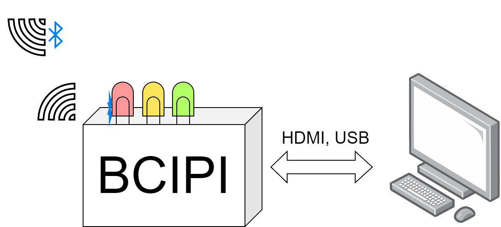

   2. **การเข้าถึงผ่าน SSH**: เชื่อมต่อ Raspberry Pi กับเครือข่ายอินเทอร์เน็ต หรือเชื่อมต่อโดยตรงกับคอมพิวเตอร์เพื่อรับ IP สำหรับการเข้าถึงผ่าน SSH

      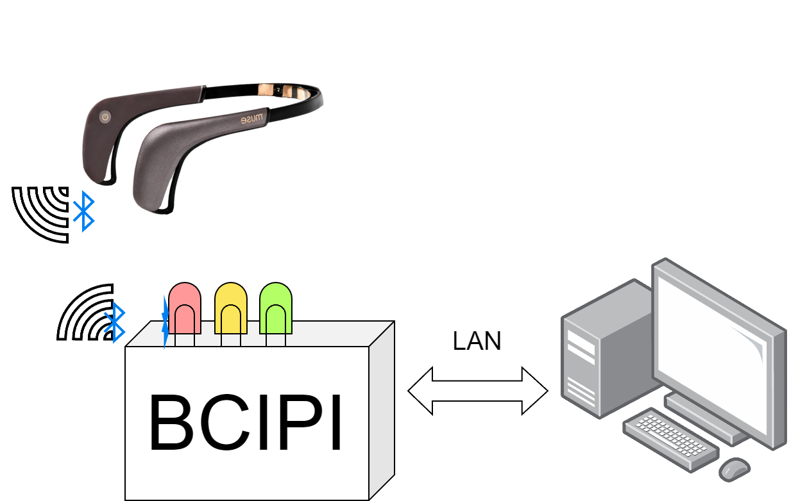

      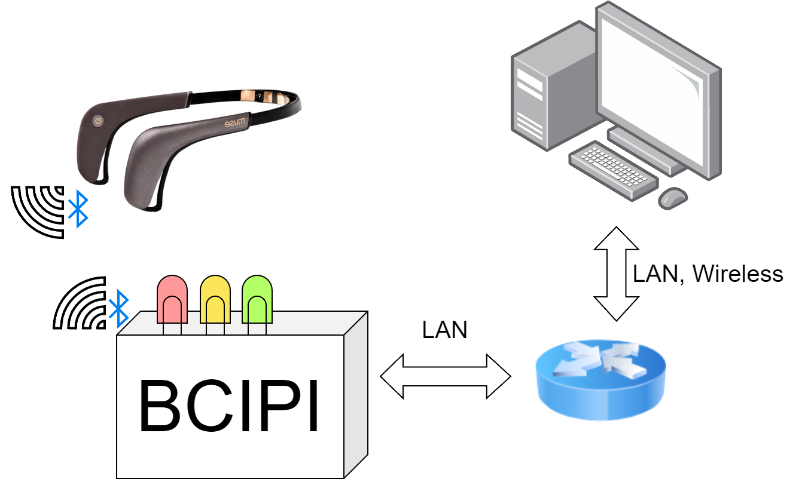

2. **เปิดใช้งาน Jupyter Notebook** โดยรันสคริปต์ `start_jupyter.sh`

   ```shell
   bash start_jupyter.sh
   ```

   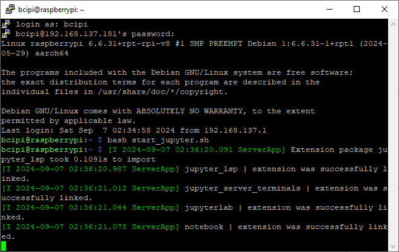

3. **เข้าใช้งาน Jupyter Notebook** ผ่านระบบเบราว์เซอร์โดยใช้ IP Address ของ Raspberry Pi

   ```html
   http://<IP ของ Raspberry Pi>:8888
   ```

   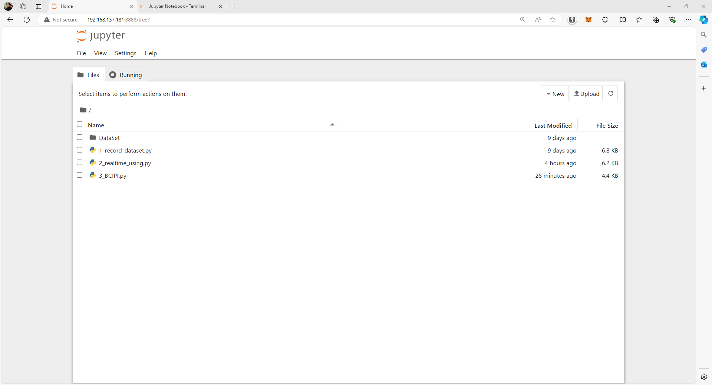

**วิธีการใช้งานระบบบันทึกคลื่นไฟฟ้าสมอง**

1. เปิด terminal ผ่าน Jupyter Notebook และรันคำสั่งต่อไปนี้

   ```shell
   python 1_record_dataset.py
   ```

   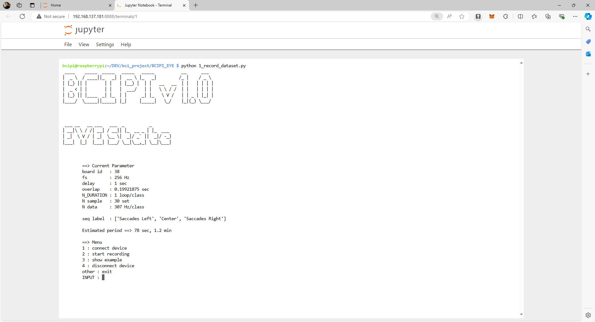

2. เปิดอุปกรณ์ Muse 2 Headband ให้ไฟสถานะเป็นสีขาวในลักษณะวิ่งขึ้นและลง จากนั้นทำการสวมใส่อุปกรณ์

   

   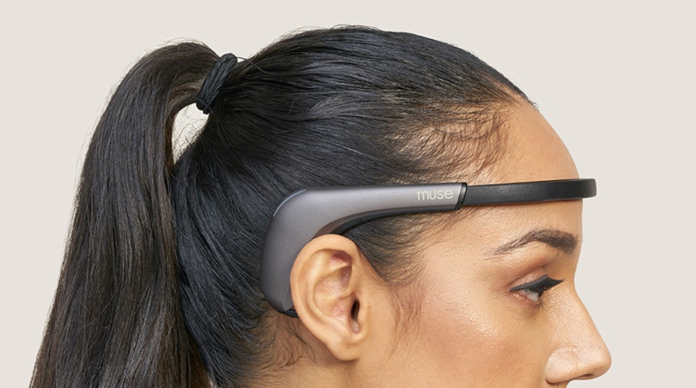

3. **เลือกเมนูที่ 1** เพื่อเชื่อมต่อกับอุปกรณ์ Muse 2 Headband ไฟจะเปลี่ยนเป็นสถานะติดค้างเมื่อเชื่อมต่อสำเร็จ

4. **เลือกเมนูที่ 3** เพื่อแสดงกระบวนการบันทึกตัวอย่าง

5. **เลือกเมนูที่ 2** เพื่อเริ่มกระบวนการบันทึกคลื่นไฟฟ้าสมอง

   1. ใส่ชื่อ subject หรือชื่อข้อมูลที่ต้องการบันทึก จากนั้นกด Enter

      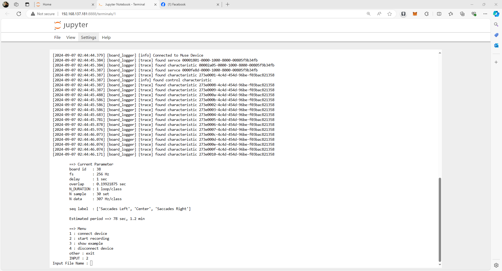

   2. เริ่มกระบวนการบันทึกข้อมูล โดยการกด Enter ในแต่ละรอบ เพื่อบันทึก 1 รอบ (การเคลื่อนไหวดวงตาไปทางซ้าย, สถานะปกติ, การเคลื่อนไหวดวงตาไปทางขวา) และทำการเคลื่อนไหวตามคำสั่งหลังจากได้ยินเสียงสัญญาณ

      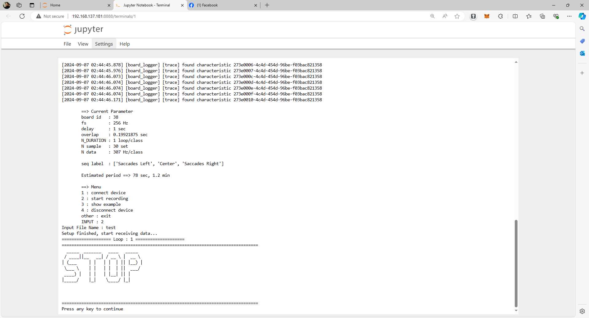

      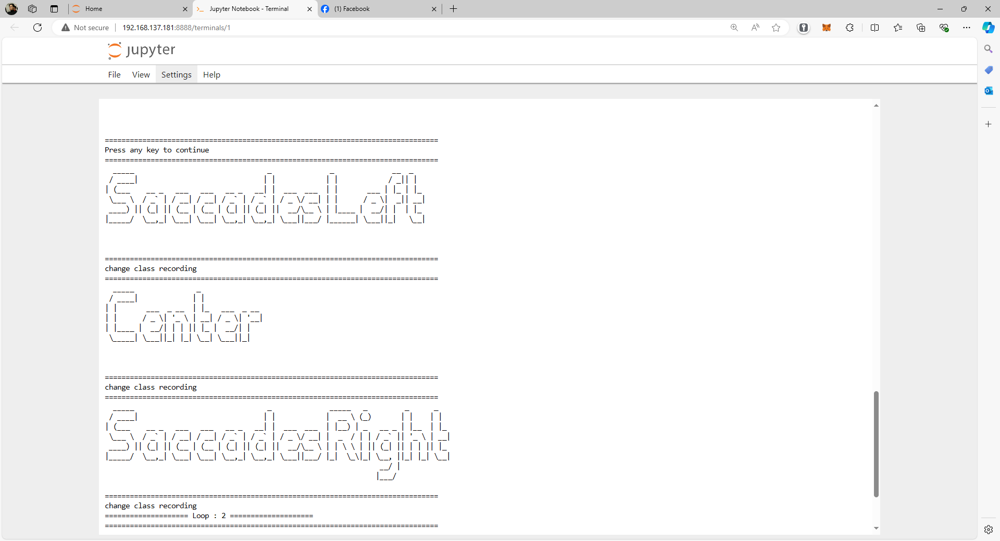

   3. เมื่อบันทึกเสร็จสิ้น โปรแกรมจะบันทึกไฟล์ข้อมูลโดยอัตโนมัติและกลับสู่หน้าหลัก

6. **เลือกเมนูที่ 4** เพื่อยกเลิกการเชื่อมต่อกับ Muse 2 Headband และสามารถใส่ตัวอักษรใด ๆ นอกจาก 4 เพื่อออกจากโปรแกรม

**วิธีการใช้งานโค้ดสำหรับการ Train Deep Learning Model**

เมื่อบันทึกข้อมูลคลื่นไฟฟ้าสมองเสร็จเรียบร้อยแล้ว สามารถนำชุดข้อมูลเหล่านี้มา Train บน Google Colab เพื่อความรวดเร็วและประสิทธิภาพ โดยทำตามกระบวนการของ Jupyter Notebook ที่เกี่ยวกับการ Train Deep Learning Model และนำผลลัพธ์ที่ได้กลับมาใช้งานบน Raspberry Pi สำหรับขั้นตอนถัดไป

**วิธีการใช้งานโค้ดสำหรับทดสอบการนำ Deep Learning Model ทำงานร่วมกับระบบ BCI บนอุปกรณ์ Raspberry Pi **

1. เปิดไฟล์ `2_realtime_using.py` และแก้ไขตำแหน่งที่เก็บ model ที่ได้บันทึกไว้

   ```python
   MODEL = tf.keras.models.load_model("/path/to/model.h5")
   
   # ตัวอย่างการเรียกใช้
   SUBJECT = "24"
   MODEL = tf.keras.models.load_model(f"./DataSet/S{SUBJECT}/model_results_S{SUBJECT}/eeg_model.h5")
   ```

2. เปิด terminal ผ่าน Jupyter Notebook และรันคำสั่ง

   ```shell
   python 2_realtime_using.py
   ```

   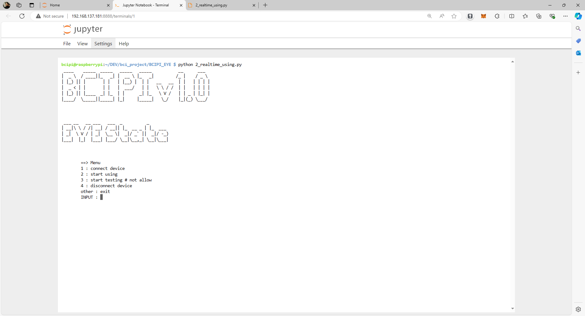

   เมื่อโปรแกรมพร้อมทำงาน ไฟ LED ทั้งสามดวงบนอุปกรณ์จะสว่างขึ้น

   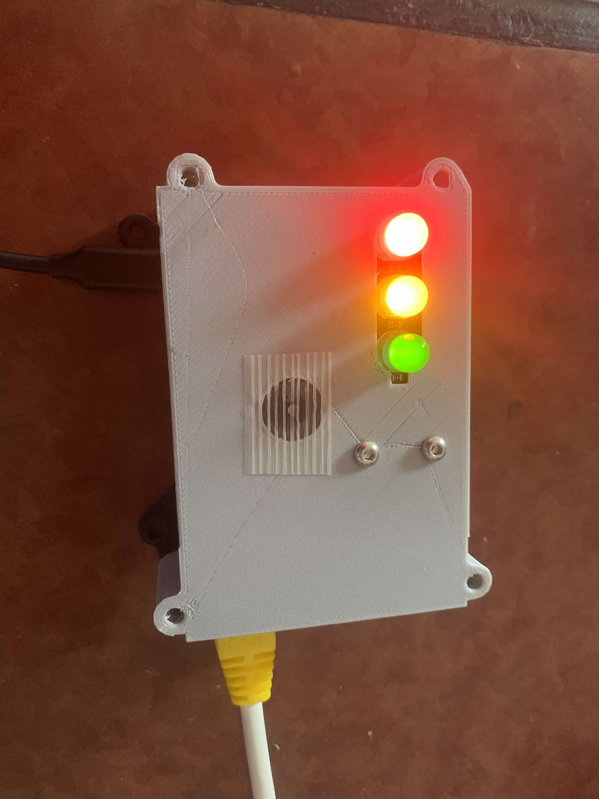

3. เปิดอุปกรณ์ Muse 2 Headband ให้ไฟสถานะเป็นสีขาวและทำการสวมใส่อุปกรณ์

   

   

4. **เลือกเมนูที่ 1** เพื่อเชื่อมต่อกับอุปกรณ์ ไฟที่ Muse 2 Headband จะเปลี่ยนเป็นติดค้างเมื่อเชื่อมต่อสำเร็จ

5. **เลือกเมนูที่ 2** เพื่อทดสอบการใช้งาน Deep Learning Model

   เมื่อเริ่มทดสอบ จะมีเสียงสัญญาณคล้ายกับขั้นตอนการบันทึกคลื่นไฟฟ้าสมอง และให้ทำการเคลื่อนไหวตามคำสั่งหลังได้ยินเสียง

   **การแสดงผลเมื่อ เคลื่อนไหวดวงตาไปทางซ้าย**

   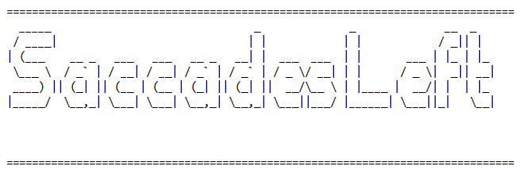

   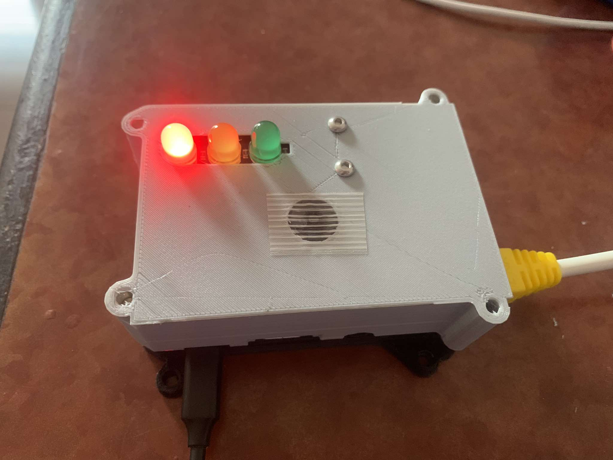

   **การแสดงผลเมื่อ สถานะปกติ**

   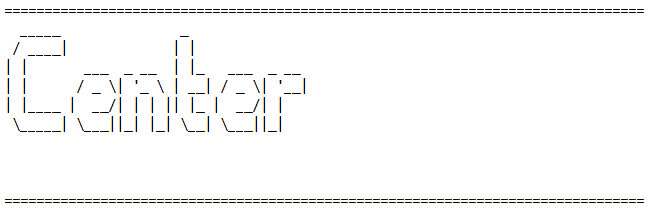

   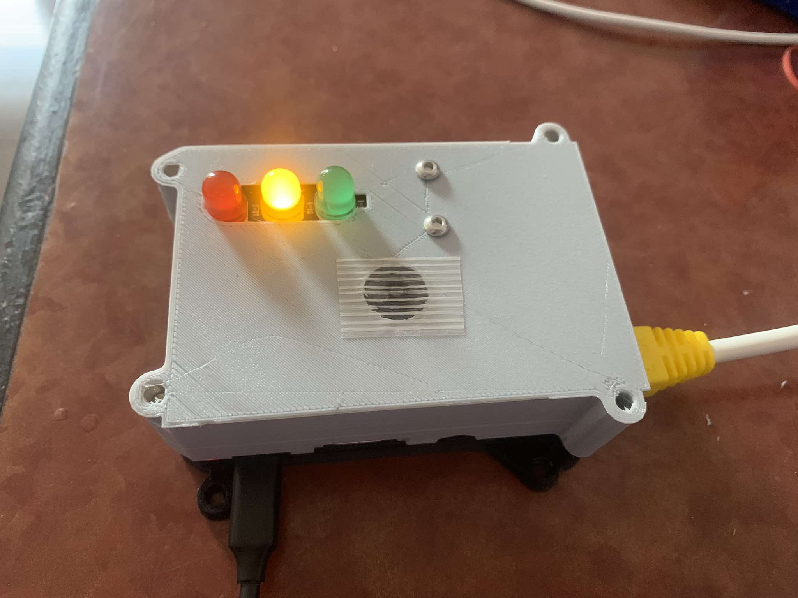

   **การแสดงผลเมื่อ เคลื่อนไหวดวงตาไปทางขวา**

   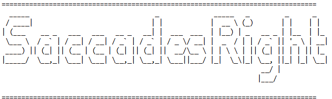

   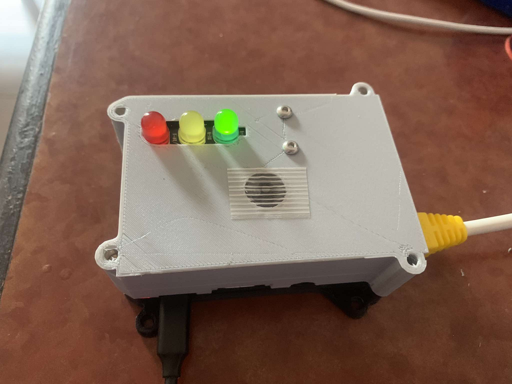

   หากต้องการออกจากเมนูนี้ ให้กด `Ctrl + C` เพื่อกลับสู่หน้าเมนูหลัก

6. **เลือกเมนูที่ 4** เพื่อยกเลิกการเชื่อมต่อกับ Muse 2 Headband และใส่ตัวอักษรใด ๆ นอกจาก 4 เพื่อออกจากโปรแกรม

**วิธีการใช้งานโค้ดสำหรับการนำ Deep Learning Model ทำงานร่วมกับระบบ BCI บนอุปกรณ์ Raspberry Pi**

1. เปิดไฟล์ `3_BCIPI.py` และแก้ไขตำแหน่งของ model ที่เราบันทึกไว้

   ```python
   MODEL = tf.keras.models.load_model("/path/to/model.h5")
   
   # ตัวอย่างการเรียกใช้
   SUBJECT = "24"
   MODEL = tf.keras.models.load_model(f"./DataSet/S{SUBJECT}/model_results_S{SUBJECT}/eeg_model.h5")
   ```

2. กลับไปที่หน้า terminal บนอุปกรณ์ และเปิดไฟล์ `run_bci_project.sh` โดยใช้คำสั่ง

   ```shell
   vim run_bci_project.sh
   ```

   จากนั้นเพิ่มโค้ดต่อไปนี้

   ```sh
   #!/bin/bash
   cd /home/bcipi/DEV/bci_project/BCIPI_EYE
   source ../brain_env/bin/activate
   python 3_BCIPI.py
   deactivate
   ```

   ทดสอบการทำงานโดยใช้คำสั่ง

   ```shell
   bash run_bci_project.sh
   ```

   **ขั้นตอนนี้ไม่มี GUI ปรากฏ** ให้เปิดอุปกรณ์ Muse 2 Headband ให้ไฟเป็นสีขาวในลักษณะวิ่งขึ้น-ลง และสวมใส่อุปกรณ์ โปรแกรมจะเชื่อมต่อและใช้งาน Deep Learning Model โดยอัตโนมัติ เมื่อเลิกใช้งาน กดปุ่มที่ Muse 2 Headband ค้างจนไฟดับ โปรแกรมจะเข้าสู่โหมดรอเชื่อมต่อใหม่อีกครั้ง

3. ตั้งค่าให้โปรแกรมทำงานตอนเริ่มเปิดอุปกรณ์ Raspberry Pi 

   ตั้งค่า cronjob โดยใช้คำสั่ง

   ```shell
   sudo crontab -e
   ```

   เพิ่มคำสั่งนี้ในบรรทัดสุดท้ายแล้วบันทึก

   ```shell
   @reboot /home/bcipi/run_bci_project.sh
   ```

   จากนั้นรีบูตอุปกรณ์ด้วยคำสั่ง

   ```shell
   sudo reboot
   ```

   เมื่อระบบรีบูตเสร็จสิ้น โปรแกรม `run_bci_project.sh` จะเริ่มทำงานโดยอัตโนมัติ
